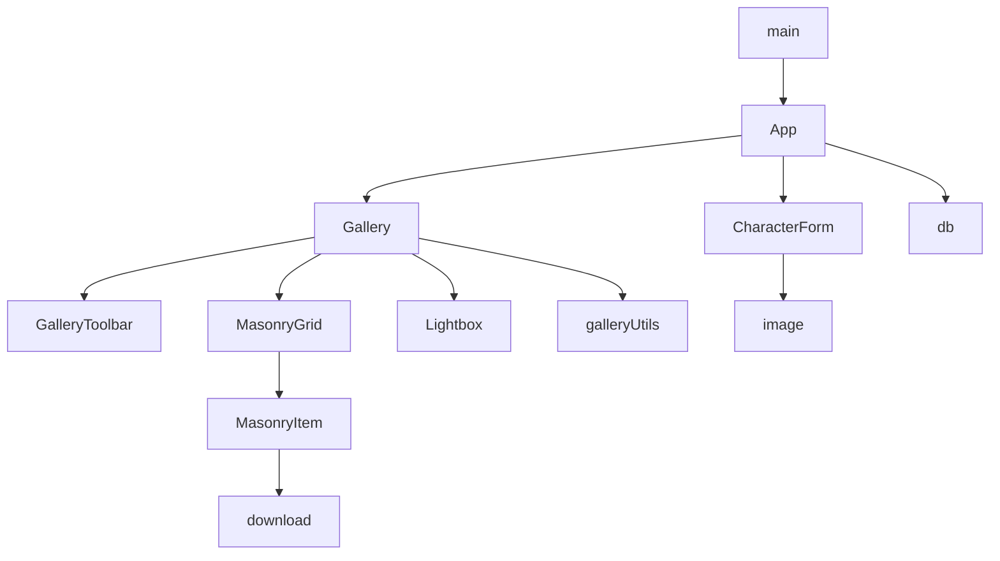

# Character Gallery: LLM Context

Purpose: machine-readable orientation for this repository. Read this file before the source.
Audience: a coding agent that will modify the code. Optimized for retrieval, not for prose.
Companion documents: `docs/WIKI.md` (narrative, developer-facing), `docs/designMasonry.md` (layout rationale).

Facts below are verified against the current `HEAD`. When this file and the code disagree, the code wins. Update this file in the same commit as the code.

---

## 1. Task Loop

```bash
npm install            # once
npm run dev            # Vite dev server, http://localhost:5173
npm test               # vitest run, all files
npx vitest run tests/gallery-scroll.test.ts   # one file
npx vitest run -t "sentinel"                  # by test name
npm run check          # svelte-check (types for src + tests)
npm run build          # vite build -> dist/ (does NOT type-check)
```

Definition of done for a code change:

1. `npm test` passes (49 tests, 6 files at the time of writing).
2. `npm run check` reports `0 errors and 0 warnings`.
3. `npm run build` succeeds.
4. The matching document is updated.

No CI, no linter, no formatter. `git log --oneline` messages record why the current code is shaped the way it is; read them before "simplifying" odd-looking code.

---

## 2. Repo Map

| Path | Role | Open when |
|---|---|---|
| `index.html` | Entry page, loads `src/main.ts` | Rarely |
| `src/main.ts` | `mount(App, { target: '#app' })` | Never |
| `src/App.svelte` | DB connection, `characters` array, save/delete, dimension backfill | Persistence, list lifecycle |
| `src/types.ts` | `Character` interface | Any data-shape question |
| `src/db.ts` | IndexedDB open/add/delete/getAll | Storage behavior |
| `src/id.ts` | `generateId()` | Id format |
| `src/image.ts` | `measureImage(src)` | Intrinsic size logic |
| `src/gallery-utils.ts` | `PAGE_SIZE`, `SortMode`, filter/sort | Search, sort, page size |
| `src/download.ts` | Data URL parse, PNG conversion, filename, download | Export path |
| `src/style.css` | Tailwind import + `@theme` color tokens | Colors, theme |
| `src/components/Gallery.svelte` | View state: search, sort, selection, paging, lightbox state | Any gallery behavior |
| `src/components/GalleryToolbar.svelte` | Search input, sort select, select-mode controls | Toolbar UI |
| `src/components/MasonryGrid.svelte` | CSS columns, keyed list, flip/fade animation | Layout, animation |
| `src/components/MasonryItem.svelte` | One card: image, hover label, download, checkbox | Card UI |
| `src/components/Lightbox.svelte` | `<dialog>` detail view, keyboard + button nav | Detail view |
| `src/components/CharacterForm.svelte` | Add/edit form, file read, dimension capture | Form behavior |
| `tests/*` | Vitest suites + helpers | Any behavior change |
| `docs/WIKI.md` | Developer wiki | Before changing architecture |

Recommended reading order for first contact: `src/types.ts` -> `src/App.svelte` -> `src/components/Gallery.svelte` -> `src/gallery-utils.ts` -> `src/db.ts` -> the remaining components.

Component graph:



---

## 3. API Surface (exact)

```ts
// src/types.ts
export interface Character {
  id: string; name: string; description: string; image: string;
  width?: number; height?: number; createdAt: number;
}

// src/db.ts
export const STORE_NAME = 'characters';
export function openDB(dbName: string): Promise<IDBDatabase>;
export function dbAdd<T>(db: IDBDatabase, item: T): Promise<void>;      // put: insert-or-replace
export function dbDelete(db: IDBDatabase, id: string): Promise<void>;
export function dbGetAll<T>(db: IDBDatabase): Promise<T[]>;
export function dbDeleteMany(db: IDBDatabase, ids: string[]): Promise<void>;

// src/id.ts
export function generateId(): string;   // crypto.randomUUID(), fallback: time36 + random

// src/image.ts
export function measureImage(src: string): Promise<{ width: number; height: number }>;

// src/gallery-utils.ts
export const PAGE_SIZE = 24;
export type SortMode = 'newest' | 'oldest' | 'name';
export function filterCharacters(characters: Character[], searchTerm: string): Character[];
export function sortCharacters(characters: Character[], sortMode: SortMode): Character[];
export function filterAndSortCharacters(characters: Character[], searchTerm: string, sortMode: SortMode): Character[];

// src/download.ts
export function parseDataUrl(dataUrl: string): { mime: string; base64: string; ext: string };
export function base64ToBlob(base64: string, mime: string): Blob;
export function sanitizeFilename(name: string): string;
export function downloadCharacterImage(character: Character): Promise<void>;
```

`parseDataUrl` throws with these messages (asserted by tests):
`'Invalid data URL'` (no match), `'Unsupported data URL type: <mime>'` (not `image/*`), `'Unsupported data URL: expected base64 encoding'` (missing `;base64`).

`sanitizeFilename` returns `'character'` for an empty result or a reserved Windows base name (`con prn aux nul com1-9 lpt1-9`); it strips `\ / : * ? " < > |`, control chars, and trailing dots/spaces.

---

## 4. Component Contracts

| Component | Props (`?` = optional) | Notes |
|---|---|---|
| `App` | none | Only writer of the database. Owns `characters`. |
| `Gallery` | `characters`, `onEdit(id)`, `onDelete(id)`, `onDeleteMany(ids) => Promise<boolean>` | Owns view state and lightbox selection. |
| `GalleryToolbar` | `searchTerm`, `sortMode`, `onSearchChange`, `onSortChange`, `selectMode?`, `selectedCount?`, `onToggleSelectMode?`, `onDeleteSelected?`, `onCancelSelect?` | Two modes: normal and selection. |
| `MasonryGrid` | `characters`, `animate?`, `onOpen(id)`, `selectMode?`, `selectedIds?`, `onToggleSelect?(id)`, `onDownload?(character)` | Pure layout + keyed list. No data access. |
| `MasonryItem` | `character`, `onOpen`, `selectMode?`, `selected?`, `onToggleSelect?`, `onDownload?` | Reserves the aspect ratio from `width`/`height`. |
| `Lightbox` | `character: Character \| null`, `characters`, `onEdit(id)`, `onDelete(id)`, `onClose()`, `onSelect(id)` | `characters` is the filtered list, so arrows move within the filter. |
| `CharacterForm` | `editingCharacter: Character \| null`, `onSave(data) => Promise<void>`, `onCancel()` | Mounted per target by `{#key}`. `onSave` rejects on failure. |

Component-local state (do not duplicate it in a parent):

- `Gallery`: `searchTerm`, `sortMode`, `selectedCharacter`, `selectMode`, `selectedIds`, `visibleCount`, `sentinelEl`; derived `filteredCharacters`, `visibleCharacters`, `hasMore`.
- `Lightbox`: `dialogEl` (`$state`), `triggerButton`, `toreDown`; derived `index`, `hasPrevious`, `hasNext`.
- `CharacterForm`: `name`, `description`, `imagePreview`, `saving`, `measured` (`{src,width,height} | null`).
- `App`: `db`, `characters`, `editingCharacter`, `showForm`, `loading`.

---

## 5. Invariants

MUST hold after any change.

1. `Character.id` is the IndexedDB key path (`db.ts`, store `characters`, keyPath `id`). Ids are opaque, unique, and never derived from array position.
2. `createdAt` is set once. `App.handleSave` copies the stored value when `data.id` matches an existing record. Never write `Date.now()` over an existing record.
3. `width`/`height` describe `image`. If unknown, leave both `undefined` and let `App.backfillDimensions` measure them. Stale values distort the reserved `aspect-ratio`.
4. `image` is a base64 image data URL. It is required for a new record.
5. Sort and filter never mutate their input array (`sortCharacters` copies; `filterCharacters` returns the input itself for a blank term).
6. Filter and sort tolerate records with missing `name` or `description`.
7. `PAGE_SIZE` lives in `src/gallery-utils.ts`. Do not re-hard-code 24.
8. `visibleCount` resets to `PAGE_SIZE` on a search or sort change.
9. `Gallery.sentinelEl` stays `$state`. The `$effect` must read it so the observer attaches to the live element and disconnects from a replaced one. See `tests/gallery-scroll.test.ts`.
10. `Lightbox` teardown runs only from the dialog `close` event. Do not close from a keydown handler or the DOM and the parent state can diverge.
11. Every DB write promise rejects on `error` and on `abort`. A pending-forever promise is a bug.
12. `downloadCharacterImage` always emits PNG and always runs the name through `sanitizeFilename`. The object URL is released ~60 s after the click, not immediately.
13. Reduced motion (`prefers-reduced-motion`) gates durations and `transform`. It MUST NOT gate the visibility of a control (the hover label and the download button stay reachable).
14. No runtime dependencies. `dependencies` must stay absent unless there is an explicit decision to add one.
15. `npm run check` stays at 0 errors and 0 warnings. Do not delete or weaken a test to make a change pass.

---

## 6. Task Routing

| Change | Files to touch | Tests to extend |
|---|---|---|
| Add/alter a `Character` field | `src/types.ts`, `src/App.svelte` (save + backfill), `src/components/CharacterForm.svelte`; `src/db.ts` only for a store/index change | `tests/db.test.ts`, `tests/app.test.ts` |
| Schema or index change | `src/db.ts` (`DB_VERSION`, `onupgradeneeded`) | `tests/db.test.ts` |
| Search behavior | `src/gallery-utils.ts` | `tests/gallery-utils.test.ts` |
| Sort behavior or a new mode | `src/gallery-utils.ts` (`SortMode`, `sortCharacters`), `src/components/GalleryToolbar.svelte` (option) | `tests/gallery-utils.test.ts` |
| Page size / paging | `src/gallery-utils.ts` (`PAGE_SIZE`), `src/components/Gallery.svelte` | `tests/gallery-scroll.test.ts` |
| Card layout or card hover UI | `src/components/MasonryItem.svelte`, `src/components/MasonryGrid.svelte` | `tests/gallery-scroll.test.ts` |
| Column layout or animation | `src/components/MasonryGrid.svelte` | — |
| Lightbox behavior | `src/components/Lightbox.svelte` | `tests/app.test.ts` |
| Download or filename | `src/download.ts` | `tests/download.test.ts` |
| Theme color | `src/style.css` (`@theme` tokens) | — |
| Id format | `src/id.ts` | `tests/id.test.ts` |
| Storage semantics | `src/db.ts` | `tests/db.test.ts` |

---

## 7. Test Recipes

Environment: Vitest with `environment: 'node'`. A DOM test needs the first line `// @vitest-environment jsdom`. `vitest.config.ts` loads the Svelte plugin and sets `resolve.conditions = ['browser']` when `process.env.VITEST` is set (required for `mount()` of Svelte 5 components).

`tests/setup.ts` provides: `fake-indexeddb` globals, `matchMedia`, a Web Animations API stub (`Element.prototype.animate` / `getAnimations`, finishes on a microtask), and `<dialog>` `showModal` / `close` / `open` plus an async `close` event.

Helpers available:

- `tests/fixtures.ts`: `PNG_1X1`, `makeCharacter(index, overrides?)`, `makeCharacters(count, startIndex?)`.
- `tests/GalleryHarness.svelte`: mounts `Gallery`, exposes `setCharacters(next)`.
- `settle()` pattern (copy from `tests/gallery-scroll.test.ts`): `flushSync()` + `await tick()` in a loop. Use it after any change that starts a transition.
- `vi.waitFor(fn, { timeout, interval })` for promise-driven UI (database reads, `FileReader`).

Component test skeleton:

```ts
// @vitest-environment jsdom
import { flushSync, mount, tick, unmount } from 'svelte';
import { describe, expect, it, vi } from 'vitest';
import Component from '../src/components/Component.svelte';

async function settle() { for (let i = 0; i < 5; i += 1) { flushSync(); await tick(); } flushSync(); }

it('does the thing', async () => {
  const target = document.createElement('div');
  document.body.appendChild(target);
  const app = mount(Component, { target, props: { /* required props */ } });
  await settle();
  expect(target.textContent).toContain('expected');
  unmount(app);
  target.remove();
});
```

Pitfalls:

- jsdom does not decode images. Stub `Image` (see `tests/app.test.ts`) before any path that calls `measureImage`.
- Stub `confirm` and `alert` before delete or validation paths.
- Elements with an `out:fade` transition stay in the DOM until the animation finishes. `settle()` is what removes them.
- IndexedDB state is shared per test file. `tests/app.test.ts` clears and seeds the `character-gallery` database in each test.

---

## 8. Sharp Edges (intentional, do not "clean up")

| Code | Why it exists |
|---|---|
| `Gallery.svelte`: `$effect` reads `sentinelEl` | The sentinel appears only after a page is full. Without a reactive read the observer is created once and never reattached, so load-more dies silently. Regression: `tests/gallery-scroll.test.ts`. |
| `App.svelte`: backfill re-reads the record and skips when `image` changed | The decode is async; a concurrent edit was previously overwritten by the stale record. |
| `App.svelte`: `createdAt: existing?.createdAt ?? Date.now()` | Editing previously reset the creation time and reordered the gallery. |
| `CharacterForm.svelte`: `untrack(() => editingCharacter?.…)` | Deliberate one-time snapshot. `App.svelte` wraps the form in `{#key editingCharacter?.id ?? 'new'}`, so each target gets a fresh instance. |
| `download.ts`: 60 s `setTimeout` before `revokeObjectURL` | An immediate revoke can cancel the download. |
| `db.ts`: `tx.onabort` rejection | Aborted transactions fire only `abort`; without it the promise never settles. |
| `MasonryGrid.svelte`: `matchMedia` read once at component creation | The duration is a construction-time constant; the values only drive `animate:flip` / `fade`. |
| `tests/setup.ts` shims | jsdom lacks `matchMedia`, WAAPI, and real `<dialog>` methods. The shims are approximations, not test logic. |

---

## 9. Known Gaps (do not assume these exist)

- No import/export of character cards; no SillyTavern card format support.
- No thumbnails or blob storage; images are base64 strings held in memory for every record.
- No image load/error UI; a failed image leaves an empty card of the correct shape.
- No virtualisation; `dbGetAll` loads the whole library, the gallery renders `PAGE_SIZE` at a time.
- No backdrop-click close in the lightbox (Escape and buttons only).
- No CI, ESLint, Prettier, or `.editorconfig`.
- `MasonryGrid`'s `animate` prop is `true` by literal at its only call site.
- `--color-bg-card` in `src/style.css` is unused.

---

## 10. Conventions for Edits

- Svelte 5 runes only: `$state`, `$derived`, `$props`, `$effect`. No stores, no `export let`, no `on:click` (use `onclick`).
- Destructure props in one `$props()` call with an inline type annotation; the codebase has no separate prop types.
- Callbacks are `onX` props. Async work returns a promise so the caller can show an error.
- Styling: Tailwind utility classes with the theme tokens (`bg-accent`, `border-border`, `text-zinc-300`). Add a token to `src/style.css` instead of a raw hex value.
- Comments explain a non-obvious reason, in short sentences. Do not comment the obvious.
- Keep the pure helpers free of component state so the node-environment tests can import them.
- American English, no em dashes in prose, present tense in docs.
- When you fix a bug that a test could catch, add the test in the same commit.
