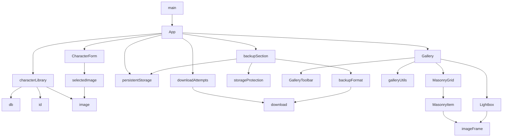

# Character Gallery: LLM Context

Purpose: machine-readable orientation for this repository. Read this file before the source.
Audience: a coding agent that will modify the code. Optimized for retrieval, not for prose.
Companion documents: `docs/WIKI.md` (narrative, developer-facing), `docs/designMasonry.md` (layout rationale).

Facts below are verified against the current `HEAD`. When this file and the code disagree, the code wins. Update this file in the same pull request when a change affects the guide; the [Documentation Map](WIKI.md#18-documentation-map) states the detailed rule.

---

## 1. Task Loop

```bash
npm install            # once
npm start              # build if dist/ is stale, serve it on :4173, open the browser
npm run dev            # Vite dev server, http://localhost:5173
npm test               # vitest run, all files
npx vitest run tests/gallery-scroll.test.ts   # one file
npx vitest run -t "sentinel"                  # by test name
npm run check          # svelte-check (types for src + tests)
npm run build          # vite build -> dist/ (does NOT type-check)
```

Definition of done for a code change:

1. `npm test` passes.
2. `npm run check` reports `0 errors and 0 warnings`.
3. `npm run build` succeeds.
4. The applicable documents are updated, per the [Documentation Map](WIKI.md#18-documentation-map).

There is no local linter or formatter: run the three commands above by hand. CI (`.github/workflows/ci.yml`) runs the same three commands for pushes to `main`, pull requests, and manual dispatch. It tests six Node and npm combinations. Four use the latest npm 12: Node 24.15.0, the latest 24.x, 26.0.0, and the latest 26.x. Two use npm 12.0.0: Node 24.15.0 and 26.0.0. Each combination enforces the dependency engine ranges during the install. See `CONTRIBUTING.md` for the merge expectations. `git log --oneline` messages record why the current code is shaped the way it is; read them before "simplifying" odd-looking code.

---

## 2. Repo Map

| Path | Role | Open when |
|---|---|---|
| `index.html` | Entry page, loads `src/main.ts` | Rarely |
| `src/main.ts` | `mount(App, { target: '#app' })` | Never |
| `src/App.svelte` | Page shell: renders the library state and its status, the delete notice, the download notice, and the form or gallery | Page layout, start-up states, notices, Retry focus, the form return handover |
| `src/types.ts` | `Character` interface | Any data-shape question |
| `src/character-library.svelte.ts` | `CharacterLibrary` class: the canonical list, start-up and Retry, record rules, mutation ordering, delete outcomes, legacy size repair | Any persistence, list, or record-rule change |
| `src/library-error.ts` | `LibraryError` + `LibraryErrorKind`, no storage imports | Error-kind branching in a component |
| `src/backup-format.ts` | The version-1 Backup file: header, file name, version rule, record matrix, streaming reader. No storage and no DOM | Reading or writing a Backup file |
| `src/db.ts` | IndexedDB open/add/delete/getAll and the bulk write | Storage behavior |
| `src/id.ts` | `generateId()` | Id format |
| `src/image.ts` | `measureImage(src)` | Intrinsic size logic |
| `src/image-frame.ts` | The frame rule shared by the card and the lightbox: stored pair or 4:3 fallback, plus the source-scoped failure check | Image shape or image-failure display |
| `src/download-attempts.svelte.ts` | `DownloadAttempts` class: page-owned attempts, per-Character ordering, the one failure notice | Download feedback |
| `src/persistent-storage.svelte.ts` | `PersistentStorage` class: the page-owned eviction-protection answer, one request, the user-initiated retry | Storage-protection line |
| `src/selected-image.svelte.ts` | `SelectedImage` class: choice ordering, image/dimension pairing, readiness, discard, obsolete-result suppression | Character form image behavior |
| `src/gallery-utils.ts` | `PAGE_SIZE`, `SortMode`, filter/sort | Search, sort, page size |
| `src/download.ts` | Data URL parse, PNG conversion, filename, download | Export path |
| `src/style.css` | Tailwind import + `@theme` color tokens | Colors, theme |
| `src/components/Gallery.svelte` | View state: search, sort, selection, paging, lightbox state, the one-shot return request | Any gallery behavior |
| `src/components/GalleryToolbar.svelte` | Search input, sort select, select-mode controls | Toolbar UI |
| `src/components/MasonryGrid.svelte` | CSS columns, keyed list, flip/fade animation | Layout, animation |
| `src/components/MasonryItem.svelte` | One card: image, hover label, download, checkbox | Card UI |
| `src/components/Lightbox.svelte` | `<dialog>` detail view, keyboard + button nav, focus restore with the Edit handover exception | Detail view |
| `src/components/CharacterForm.svelte` | Add/edit form, text fields, save gating and locking, entry and save-start focus | Form behavior |
| `src/components/BackupSection.svelte` | The Backup and restore section below the Gallery: the two actions, counts, confirmation, and its own feedback | Backup or Restore behavior |
| `src/components/StorageProtection.svelte` | The storage-protection line and **Try again** | Storage-protection UI |
| `tests/backup-format.test.ts` | The version-1 file contract at the format seam | Any change to the file format or its reader |
| `tests/backup-section.test.ts` | The mounted Backup action, its disable rules, and its handoff | Backup UI |
| `tests/restore-section.test.ts` | The mounted Restore: counts, confirmation, cancel, refusals, additive writes | Restore UI |
| `tests/storage-protection.test.ts` | The protection owner and its line, plus a denial that gates nothing | Storage-protection behavior |
| `tests/download-blob.test.ts` | The one Blob delivery path and the delayed release of the object URL | Download delivery |
| `tests/*` | Vitest suites + helpers | Any behavior change |
| `docs/adr/0002-character-library-backup-and-restore.md` | The accepted Backup and Restore decision | Before changing the file format or the Restore rule |
| `docs/verification/72-backup-restore-browser-evidence.md` | The real-browser and large-library record for Backup and Restore, with its limits | Before claiming a browser result |
| `docs/WIKI.md` | Developer wiki | Before changing architecture |

Recommended reading order for first contact: `src/types.ts` -> `src/character-library.svelte.ts` -> `src/App.svelte` -> `src/components/Gallery.svelte` -> `src/gallery-utils.ts` -> `src/db.ts` -> the remaining components.

Component graph:


```mermaid
graph TD
  main --> App
  App --> characterLibrary
  App --> downloadAttempts
  App --> persistentStorage
  App --> Gallery
  App --> CharacterForm
  App --> backupSection
  characterLibrary --> db
  characterLibrary --> id
  characterLibrary --> image
  downloadAttempts --> download
  backupSection --> backupFormat
  backupSection --> persistentStorage
  backupSection --> storageProtection
  backupFormat --> download
  Gallery --> GalleryToolbar
  Gallery --> MasonryGrid
  Gallery --> Lightbox
  Gallery --> galleryUtils
  MasonryGrid --> MasonryItem
  MasonryItem --> imageFrame
  Lightbox --> imageFrame
  CharacterForm --> selectedImage
  selectedImage --> image
```

---

## 3. API Surface (exact)

```ts
// src/types.ts
export interface Character {
  id: string; name: string; description: string; image: string;
  width?: number; height?: number; createdAt: number;
}

// src/db.ts
export const STORE_NAME = 'characters';
export function openDB(dbName: string): Promise<IDBDatabase>;
export function dbAdd<T>(db: IDBDatabase, item: T): Promise<void>;      // put: insert-or-replace
export function dbDelete(db: IDBDatabase, id: string): Promise<void>;
export function dbGetAll<T>(db: IDBDatabase): Promise<T[]>;
export function dbDeleteMany(db: IDBDatabase, ids: string[]): Promise<void>;
export function dbPutMany<T>(db: IDBDatabase, items: readonly T[]): Promise<void>;  // one transaction, resolves on commit

// src/id.ts
export function generateId(): string;   // crypto.randomUUID(), fallback: time36 + random

// src/image.ts
export function measureImage(src: string): Promise<{ width: number; height: number }>;

// src/image-frame.ts
export const FALLBACK_IMAGE_SIZE = { width: 4, height: 3 };
export const IMAGE_UNAVAILABLE_TEXT = 'Image unavailable';
export function isUsableImageSize(size: { width?: number; height?: number } | null | undefined): boolean;
export function imageFrameSize(size: { width?: number; height?: number } | null | undefined): { width: number; height: number };
export function imageFrameAspectRatio(size: { width?: number; height?: number } | null | undefined): string;
export function isImageUnavailable(source: string, failedSource: string | null): boolean;

// src/download-attempts.svelte.ts
export interface DownloadNotice { characterId: string; characterName: string; }
export class DownloadAttempts {
  readonly notice: DownloadNotice | null;
  readonly message: string | null;
  start(character: Character): void;
  dismiss(): void;
}

// src/selected-image.svelte.ts
export type PreparationStatus = 'idle' | 'preparing' | 'ready' | 'failed';
export interface ImageSnapshot { image: string; width?: number; height?: number; }
export interface SelectedImageDeps {
  readFile?: (file: File) => Promise<string>;
  measure?: (src: string) => Promise<{ width: number; height: number }>;
}
export class SelectedImage {
  constructor(initial: ImageSnapshot | null, deps?: SelectedImageDeps);
  readonly image: string;
  readonly status: PreparationStatus;
  readonly error: string | null;
  readonly warning: string | null;
  readonly canSubmit: boolean;
  readonly hasReplacement: boolean;
  select(file: File): void;
  discard(): void;
  snapshot(): ImageSnapshot | null;
  dispose(): void;
}

// src/character-library.svelte.ts
export const REPAIR_WARNING: string;
export type LibraryStatus = 'loading' | 'ready' | 'failed';
export interface CharacterDraft {
  id?: string; name: string; description: string; image: string;
  width?: number; height?: number;
}
export interface CharacterLibraryDeps {
  openDatabase?: (name: string) => Promise<IDBDatabase>;
  readAll?: (db: IDBDatabase) => Promise<Character[]>;
  write?: (db: IDBDatabase, character: Character) => Promise<void>;
  remove?: (db: IDBDatabase, id: string) => Promise<void>;
  removeMany?: (db: IDBDatabase, ids: string[]) => Promise<void>;
  writeMany?: (db: IDBDatabase, records: Character[]) => Promise<void>;
  measure?: (src: string) => Promise<{ width: number; height: number }>;
  generateId?: () => string;
  now?: () => number;
  databaseName?: string;
  logger?: Pick<Console, 'warn' | 'error'>;
}
export interface RestoreCounts { added: number; skipped: number; }
export interface RestorePlan { records: Character[]; counts: RestoreCounts; }
export function planRestore(records: readonly Character[], present: readonly Character[]): RestorePlan;
export class CharacterLibrary {
  constructor(deps?: CharacterLibraryDeps);
  readonly characters: Character[];
  readonly status: LibraryStatus;
  readonly failureMessage: string | null;
  readonly repairWarning: string | null;
  initialize(): Promise<void>;
  save(draft: CharacterDraft): Promise<void>;
  remove(id: string): Promise<void>;
  removeMany(ids: string[]): Promise<void>;
  restore(records: Character[]): Promise<RestoreCounts>;
  settled(): Promise<void>;
  dispose(): void;
}

// src/persistent-storage.svelte.ts
export type ProtectionState = 'unchecked' | 'protected' | 'not-protected' | 'unsupported' | 'failed';
export interface PersistentStorageDeps {
  persisted?: (() => Promise<boolean>) | undefined;
  persist?: (() => Promise<boolean>) | undefined;
  logger?: Pick<Console, 'warn' | 'error'>;
}
export class PersistentStorage {
  constructor(deps?: PersistentStorageDeps);
  readonly state: ProtectionState;
  readonly pending: boolean;
  readonly message: string;
  readonly canRetry: boolean;
  requestOnce(): void;
  retry(): void;
}

// src/backup-format.ts
export const BACKUP_FORMAT = 'character-gallery/backup';
export const BACKUP_FORMAT_VERSION = 1;
export const BACKUP_MIME_TYPE = 'application/x-ndjson';
export const MAX_LINE_LENGTH = 128 * 1024 * 1024;
export interface BackupHeader { format: string; formatVersion: number; exportedAt: string; appVersion: string; }
export function createBackupHeader(exportedAt?: Date): BackupHeader;
export function serializeCharacterRecord(character: Character): string;
export function backupParts(characters: readonly Character[], exportedAt?: Date): string[];
export function backupFileName(date: Date): string;   // character-gallery-backup-YYYY-MM-DD.jsonl
export type BackupFileErrorKind = 'not-json-lines' | 'header' | 'format' | 'version' | 'duplicate-id' | 'line-too-long';
export class BackupFileError extends Error { readonly kind: BackupFileErrorKind; }
export interface UnreadableRecord { line: number; reason: string; }
export interface ParsedBackup { header: BackupHeader; records: Character[]; unreadable: UnreadableRecord[]; }
export interface ParseBackupOptions { maxLineLength?: number; }
export function parseBackup(chunks: AsyncIterable<string>, options?: ParseBackupOptions): Promise<ParsedBackup>;

// src/library-error.ts (re-exported by character-library.svelte.ts)
export type LibraryErrorKind = 'unavailable' | 'missing-target' | 'write-failed';
export class LibraryError extends Error {
  readonly kind: LibraryErrorKind;
  readonly cause: unknown;
}

// src/gallery-utils.ts
export const PAGE_SIZE = 24;
export type SortMode = 'newest' | 'oldest' | 'name';
export function filterCharacters(characters: Character[], searchTerm: string): Character[];
export function sortCharacters(characters: Character[], sortMode: SortMode): Character[];
export function filterAndSortCharacters(characters: Character[], searchTerm: string, sortMode: SortMode): Character[];

// src/download.ts
export const OBJECT_URL_LIFETIME_MS = 60_000;
export function parseDataUrl(dataUrl: string): { mime: string; base64: string; ext: string };
export function base64ToBlob(base64: string, mime: string): Blob;
export function sanitizeFilename(name: string): string;
export function downloadBlob(blob: Blob, filename: string): void;
export function downloadCharacterImage(character: Character): Promise<void>;
```

`parseDataUrl` throws with these messages (asserted by tests):
`'Invalid data URL'` (no match), `'Unsupported data URL type: <mime>'` (not `image/*`), `'Unsupported data URL: expected base64 encoding'` (missing `;base64`).

`sanitizeFilename` returns `'character'` for an empty result or a reserved Windows base name (`con prn aux nul com1-9 lpt1-9`); it strips `\ / : * ? " < > |`, control chars, and trailing dots/spaces.

`downloadBlob` is the one delivery path for the image export and the Backup: it clicks a temporary link and revokes the object URL after `OBJECT_URL_LIFETIME_MS`. A click is a handoff, not a saved file.

`parseBackup` rejects the whole file with a `BackupFileError` for `not-json-lines`, `header`, `format`, `version`, `duplicate-id`, or `line-too-long`, before it returns one record. A line that is not a Character is listed in `unreadable` with its 1-based line number and its first failed rule. Version 1 is the only version it reads. Two lines that carry one string `id` are a `duplicate-id` failure even when one of them fails the record matrix, because such a line still names the Character it claims to be.

---

## 4. Component Contracts

| Component | Props (`?` = optional) | Notes |
|---|---|---|
| `App` | none | Page shell. Constructs one `CharacterLibrary`, one `DownloadAttempts`, and one `PersistentStorage`, calls `initialize` on mount, asks for persistent storage once when the library is ready, and disposes the library on destroy. Renders loading, failure with Retry, the ready status, the delete notice, the download notice, the form, the gallery, and `BackupSection` below it. No storage knowledge, no record building. |
| `Gallery` | `characters`, `onEdit(id)`, `onDelete(id)`, `onDeleteMany(ids) => Promise<boolean>`, `onDownload(character)`, `notice?`, `onLightboxChange?(open)`, `returnFocusCharacterId?` | Owns view state and lightbox selection. `onDownload` only reports the Character; the page owns the attempt and the notice. `onLightboxChange` tells the page where to present that notice. `returnFocusCharacterId` is the page's one-shot return request; `pendingReturn` is the Gallery's unspent copy. |
| `GalleryToolbar` | `searchTerm`, `sortMode`, `onSearchChange`, `onSortChange`, `selectMode?`, `selectedCount?`, `onToggleSelectMode?`, `onDeleteSelected?`, `onCancelSelect?` | Two modes: normal and selection. |
| `MasonryGrid` | `characters`, `animate?`, `onOpen(id)`, `selectMode?`, `selectedIds?`, `onToggleSelect?(id)`, `onDownload?(character)` | Pure layout + keyed list. No data access. |
| `MasonryItem` | `character`, `onOpen`, `selectMode?`, `selected?`, `onToggleSelect?`, `onDownload?` | Reserves the frame from `width`/`height` through `image-frame.ts`, falling back to 4:3, and describes a failed image on the browse button or checkbox. |
| `Lightbox` | `character: Character \| null`, `characters`, `onEdit(id)`, `onDelete(id)`, `onClose()`, `onSelect(id)`, `onDownload(character)`, `notice?` | `characters` is the filtered list, so arrows move within the filter. `notice` is the page's download notice snippet, rendered inside the dialog. |
| `CharacterForm` | `editingCharacter: Character \| null`, `onSave(draft: CharacterDraft) => Promise<void>`, `onCancel()` | Mounted per Add or Edit session by `{#key}`. `onSave` rejects with a `LibraryError`; a `missing-target` rejection gets its own message. Imports the error from `library-error.ts`, not from the library module. |
| `BackupSection` | `library: CharacterLibrary`, `readFile?`, `protection?: PersistentStorage` | A view: settles, snapshots, serializes, parses, asks the library to restore, and reports. `readFile` is the file-read seam. Never builds a record or calls storage. |
| `StorageProtection` | `protection: PersistentStorage` | Renders the owner's message and **Try again**. Never asks the browser itself. |

State ownership (one owner per item; do not duplicate it):

| Owner | State | Notes |
|---|---|---|
| `CharacterLibrary` | `characters`, `status`, `failureMessage`, `repairWarning` | The canonical list and the only writer. One instance per page lifetime. |
| `CharacterLibrary` (internal) | operation chain, repair attempt keys, per-record image generations, database connection, lifetime counter | Private. Never assert on these in tests; observe the public state and the storage. |
| `App` | `editingCharacter`, `showForm`, `formSession`, `deleteNotice`, `lightboxOpen`, the focused heading, one library instance, one download owner | Presentation and navigation only. `formSession` names the Add or Edit task that owns the form slot, so a save closes only the form that began it. `lightboxOpen` comes from `Gallery`, so the page never assumes a dialog it cannot see. |
| `DownloadAttempts` | attempt and applied counters per Character, `notice` | Pending attempts and the notice survive Gallery teardown, so a failure can still reach the page while the form is open. |
| `PersistentStorage` | `state`, `pending`, the spent page-lifetime request | Advisory only. One instance per page lifetime, because the Backup section unmounts with the library's status. Nothing is gated on it. |
| `BackupSection` | `operation` (`'backup'` / `'restore'` / null), `failureMessage`, `statusMessage`; derived `busy`, `empty`, `disabled`, `reason`, `restoreDisabled` | One operation flag, so the two actions exclude each other. The library's returned counts are the report. |
| `Gallery` | `searchTerm`, `sortMode`, `selectedId`, `selectMode`, `selectedIds`, `visibleCount`, `sentinelEl`; derived `selectedCharacter`, `filteredCharacters`, `visibleCharacters`, `hasMore`, `emptyState` | View state. `selectedId` holds the open Character's identity, and `selectedCharacter` is derived from the canonical list. It also reports the dialog state upward. |
| `Lightbox` | `dialogEl` (`$state`), `triggerButton`, `toreDown`, `failed` (Character id plus source); derived `index`, `hasPrevious`, `hasNext`, `imageUnavailable` | Dialog, focus, and the displayed image's failure. |
| `CharacterForm` | `name`, `description`, `saving`, `saveError`, one `SelectedImage` | Draft and save locking. |

---

## 5. Invariants

MUST hold after any change.

1. `Character.id` is the IndexedDB key path (`db.ts`, store `characters`, keyPath `id`). Ids are opaque, unique, and never derived from array position.
2. `CharacterLibrary` is the only writer of Character records and the only owner of the canonical list. `App`, `Gallery`, and `CharacterForm` never import `db.ts`, build a record, reload the list, or start storage work. A review that finds any of those in the shell is a regression.
3. A mutation resolves only after the storage transaction commits and the committed record is published. A rejection always means nothing was committed, and storage and the canonical list still agree. A resolved mutation never triggers a full-library read.
4. `createdAt` is set once. `CharacterLibrary` copies the stored value during an edit and never re-derives it from the clock. Never write `Date.now()` over an existing record.
5. `width`/`height` describe `image`. If unknown, leave both `undefined` and let the library's background repair measure them. The stored pair reserves the card frame only when both numbers are finite and greater than zero; otherwise every image view uses the complete 4:3 fallback, so one stored side is never paired with one fallback side (`src/image-frame.ts`). A partial pair is normalized to two absent dimensions.
   - A draft with no complete pair supplies no size; a partial pair collapses to no size. With no size supplied and the image unchanged, the stored pair is kept. Otherwise the record has no size.
   - A stored pair survives a save only while the image is unchanged. A replaced image never inherits the previous dimensions.
   - `SelectedImage` publishes only the current selection. A generation token guards every asynchronous state write; `discard` and `dispose` invalidate outstanding work.
   - `SelectedImage.status` stays `preparing` until read and measurement settle. `canSubmit` is true only for `idle` or `ready` with a non-empty image. A read failure blocks submission; a measurement failure allows it with both dimensions absent.
6. An edit whose identity is not in the canonical list rejects with `missing-target` and writes nothing. Do not add a save-as-new recovery path.
7. Commits and publications run on one serialized chain in acceptance order. Image decoding never enters the chain. A start-up read waits for writes accepted before the call, then runs outside the chain, and its publication joins the chain; a newer `initialize` never waits for an older pending read. A failed step must not poison the chain.
8. Background repair writes only into the record as it stands now, and only while the record exists, still shows the measured image, is still the same image generation, and still has no size. Attempts are bounded once per identity and image generation per initialized lifetime. A failure leaves both dimensions absent, logs, and sets one `repairWarning`.
9. `dispose` publishes nothing afterwards and rejects new mutations, but an accepted write still commits and its promise still settles. Do not pretend to roll back a committed write.
10. `image` is a base64 image data URL. It is required for a new record.
11. Sort and filter never mutate their input array (`sortCharacters` copies; `filterCharacters` returns the input itself for a blank term).
12. Filter and sort tolerate records with missing `name` or `description`.
13. `PAGE_SIZE` lives in `src/gallery-utils.ts`. Do not re-hard-code 24.
14. `visibleCount` resets to `PAGE_SIZE` on a search or sort change.
15. `Gallery.sentinelEl` stays `$state`. The `$effect` must read it so the observer attaches to the live element and disconnects from a replaced one. See `tests/gallery-scroll.test.ts`.
16. `Lightbox` teardown runs from the dialog `close` event, which covers Escape, and from the direct `teardown` call in `requestClose` when the dialog is unavailable or not open. Do not close from a keydown handler or the DOM and the parent state can diverge. See `src/components/Lightbox.svelte`. The Edit action alone skips the focus restore: it sets `handedOver` before closing, because the form now owns focus and a later `close` event must not put focus back on the card.
17. Every DB write promise rejects on `error` and on `abort`. A pending-forever promise is a bug.
18. `downloadCharacterImage` always emits PNG and always runs the name through `sanitizeFilename`. The object URL is released ~60 s after the click, not immediately.
19. Reduced motion (`prefers-reduced-motion`) gates durations and the movement itself, including the FLIP and fade durations in `MasonryGrid.svelte`. The Tailwind hover and focus utilities on the page use the individual `translate` and `scale` properties rather than `transform`: the Add Character and Delete Selected lifts use `translate`, and the card image uses `scale`. Keep the gate on the animation itself, because a Svelte FLIP animation still animates `transform`. It MUST NOT gate the visibility of a control (the hover label and the download button stay reachable).
20. Start-up is three distinct states. Loading is not an empty library. A failed start keeps Retry and the reason on screen and keeps Add and edit entry points unavailable. Retry never deletes or replaces stored records.
21. A delete failure is announced in one place in the page shell and keeps the records and the batch selection. A committed batch delete clears the selection and leaves select mode.
22. No runtime dependencies. `dependencies` must stay absent unless there is an explicit decision to add one.
23. `npm run check` stays at 0 errors and 0 warnings. Do not delete or weaken a test to make a change pass.
24. A form's return handover happens once, after the destination renders, and resolves an edited Character by identity rather than by name. The browse card carries that identity as `data-character-id`, and `Gallery` matches the attribute rather than the rendered order. A later page of results never repeats the handover. A control the user focused outside the form while a save was pending keeps the focus, but a page with nothing focused hands over. A rejected save moves no focus to the Gallery. A save completion belongs to the form that started it, so a completion that arrives after the user opened another form leaves that form, its draft, and its focus alone. See `src/App.svelte` and `src/components/Gallery.svelte`.
25. The Backup file is the version-1 contract in `src/backup-format.ts`: one header line, then one stored Character per line. **Format version 1 stays restorable.** A later app version keeps reading `formatVersion: 1`. An unknown or newer version is refused before any write, and the refusal names the declared version.
26. A restored Character keeps its stored `id` and `createdAt`. Never mint an identity or a creation time on Restore, and never write a record over an existing identity.
27. Restore is additive and idempotent. A record whose identity is already in the canonical list is skipped, so re-Restoring one Backup converges and a stale Backup never rolls back local work. Overwrite or rollback Restore is out of scope. The rule is the exported pure `planRestore`: `restore` recomputes it on its chain and the Backup section previews the confirmation with it, so one function states the rule.
28. One Restore commits every admitted record or none. The batch goes to `dbPutMany` in one transaction, the canonical list is published only after that commit, and a rejection leaves storage and the list unchanged. `restore` returns `RestoreCounts`, and those are the counts it applied.
29. No single string spans the library in either direction. Export writes per-record parts into one Blob, and import reads chunks and holds at most one unfinished line. The format module never touches storage or the DOM, and the library stays the only writer: a Backup reads the canonical list only after `settled()`.
30. A structural file failure writes nothing. A record that fails the record matrix is skipped and reported with its line number and its first failed rule, never dropped silently. The whole file is read and validated before the first write.

---

## 6. Task Routing

| Change | Files to touch | Tests to extend |
|---|---|---|
| Add/alter a `Character` field | `src/types.ts`, `src/character-library.svelte.ts` (record rules + repair), `src/components/CharacterForm.svelte`; `src/db.ts` only for a store/index change | `tests/character-library.test.ts`, `tests/db.test.ts`, `tests/app.test.ts` |
| Persistence rules, start-up, delete outcomes, or size repair | `src/character-library.svelte.ts` | `tests/character-library.test.ts`, `tests/app.test.ts` |
| Page layout, start-up states, the delete notice, or the form return handover | `src/App.svelte`, `src/components/Gallery.svelte` for the card target | `tests/app.test.ts` |
| Schema or index change | `src/db.ts` (`DB_VERSION`, `onupgradeneeded`) | `tests/db.test.ts` |
| Search behavior | `src/gallery-utils.ts` | `tests/gallery-utils.test.ts` |
| Sort behavior or a new mode | `src/gallery-utils.ts` (`SortMode`, `sortCharacters`), `src/components/GalleryToolbar.svelte` (option) | `tests/gallery-utils.test.ts` |
| Page size / paging | `src/gallery-utils.ts` (`PAGE_SIZE`), `src/components/Gallery.svelte` | `tests/gallery-scroll.test.ts` |
| Card layout or card hover UI | `src/components/MasonryItem.svelte`, `src/components/MasonryGrid.svelte` | `tests/gallery-scroll.test.ts` |
| Column layout or animation | `src/components/MasonryGrid.svelte` | — |
| Lightbox behavior or its focus restore | `src/components/Lightbox.svelte` | `tests/app.test.ts` |
| Download or filename | `src/download.ts` | `tests/download.test.ts` |
| Selected-image preparation or form gating | `src/selected-image.svelte.ts`, `src/components/CharacterForm.svelte` | `tests/selected-image.test.ts`, `tests/character-form.test.ts` |
| Form focus entry, save-start handover, or return handover | `src/components/CharacterForm.svelte`, `src/App.svelte`, `src/components/Gallery.svelte` | `tests/character-form.test.ts`, `tests/app.test.ts` |
| Theme color | `src/style.css` (`@theme` tokens) | — |
| Id format | `src/id.ts` | `tests/id.test.ts` |
| Storage semantics | `src/db.ts` | `tests/db.test.ts` |
| The Backup file format, its header, or the record matrix | `src/backup-format.ts` | `tests/backup-format.test.ts` |
| The Restore rule, its counts, or the settle barrier | `src/character-library.svelte.ts` | `tests/character-library.test.ts` |
| The Backup or Restore view, its counts, or its feedback | `src/components/BackupSection.svelte` | `tests/backup-section.test.ts`, `tests/restore-section.test.ts` |
| The storage-protection answer or its line | `src/persistent-storage.svelte.ts`, `src/components/StorageProtection.svelte` | `tests/storage-protection.test.ts` |
| The delivery of a downloaded Blob | `src/download.ts` | `tests/download-blob.test.ts`, `tests/download.test.ts` |

---

## 7. Test Recipes

Environment: Vitest with `environment: 'node'`. A DOM test needs the first line `// @vitest-environment jsdom`. `vitest.config.ts` loads the Svelte plugin and sets `resolve.conditions = ['browser']` when `process.env.VITEST` is set (required for `mount()` of Svelte 5 components).

`tests/setup.ts` provides: `fake-indexeddb` globals, `matchMedia`, a Web Animations API stub (`Element.prototype.animate` / `getAnimations`, finishes on a microtask), and `<dialog>` `showModal` / `close` / `open` plus an async `close` event.

Helpers available:

- `tests/fixtures.ts`: `PNG_1X1`, `makeCharacter(index, overrides?)`, `makeCharacters(count, startIndex?)`.
- `tests/GalleryHarness.svelte`: mounts `Gallery`, exposes `setCharacters(next)`.
- `tests/LightboxHarness.svelte`: mounts `Lightbox` with a replaceable list and a chosen open Character.
- `tests/selected-image.test.ts`: controlled `readFile` and `measure` promises for the preparation module.
- `tests/character-library.test.ts`: constructs `CharacterLibrary` with the real `db.ts` helpers against a unique `fake-indexeddb` database per test. Controls measurement, identity, the clock, and held writes; asserts the canonical list, the start-up state, the repair warning, and storage.
- `tests/character-form.test.ts`: a controlled `FileReader` and `Image` for the mounted form. It also rejects with a `LibraryError` to witness the missing-target message.
- A manual real-browser smoke check ran in headless Chrome 156 on Windows against the production build. It covers real file reading and image decoding through programmatic file-input assignment, same-file recovery, and the accessible feedback markup. It does not exercise the native picker dialog or a screen-reader announcement. It is not part of `npm test`; see WIKI section 13.
- A second manual check in headless Chrome 156.0.8078.49 on Windows 11 covers the Gallery states, card and lightbox image failures with measured frame geometry, and the download notice across page, dialog, and form, including measured contrast. Android, Firefox, Safari, screen readers, and save completion stay unverified. The numbers and limits are in WIKI section 13.
- A real-browser recheck in headless Edge 156 on Windows covers Backup, Restore, a 267 MB library, the storage line, and the keyboard path. Its limits and its numbers are in `docs/verification/72-backup-restore-browser-evidence.md` and WIKI section 13. It confirms the download event and the driver's bytes, not a file that the browser or the operating system wrote.
- `tests/backup-section.test.ts` mocks `src/download.ts` and passes a `readFile` seam. `tests/restore-section.test.ts` feeds chunks through the same seam. `tests/storage-protection.test.ts` injects `persisted` and `persist` promises, or `undefined` for a browser that reports neither.
- `settle()` pattern (copy from `tests/gallery-scroll.test.ts`): `flushSync()` + `await tick()` in a loop. Use it after any change that starts a transition.
- `vi.waitFor(fn, { timeout, interval })` for promise-driven UI (database reads, `FileReader`).

Component test skeleton:

```ts
// @vitest-environment jsdom
import { flushSync, mount, tick, unmount } from 'svelte';
import { describe, expect, it, vi } from 'vitest';
import Component from '../src/components/Component.svelte';

async function settle() { for (let i = 0; i < 5; i += 1) { flushSync(); await tick(); } flushSync(); }

it('does the thing', async () => {
  const target = document.createElement('div');
  document.body.appendChild(target);
  const app = mount(Component, { target, props: { /* required props */ } });
  await settle();
  expect(target.textContent).toContain('expected');
  unmount(app);
  target.remove();
});
```

Pitfalls:

- jsdom does not decode images. Stub `Image` (see `tests/app.test.ts`) before any path that calls `measureImage`.
- Stub `confirm` and `alert` before delete or validation paths.
- Elements with an `out:fade` transition stay in the DOM until the animation finishes. `settle()` is what removes them.
- IndexedDB state is shared per test file. `tests/app.test.ts` clears and seeds the `character-gallery` database in each test.

---

## 8. Sharp Edges (intentional, do not "clean up")

| Code | Why it exists |
|---|---|
| `Gallery.svelte`: `$effect` reads `sentinelEl` | The sentinel appears only after a page is full. Without a reactive read the observer is created once and never reattached, so load-more dies silently. Regression: `tests/gallery-scroll.test.ts`. |
| `character-library.svelte.ts`: operation chain and commit-then-publish | Every write and its publication run in one serialized step, so an older result cannot land after a newer one and there is no full reload after a save. |
| `character-library.svelte.ts`: repair merges into the current record | The decode is slow and the user can edit meanwhile. Writing the snapshot back would revert a newer name or description. Regression: `tests/character-library.test.ts`. |
| `character-library.svelte.ts`: attempt key is identity plus image generation | An ordinary publication must not re-attempt a failed measurement, a replaced image must be eligible again, and a fresh start must try once more. |
| `character-library.svelte.ts`: mutations reject while unavailable | The page shell used to swallow a save with no storage, which lost the draft without a message. Persistence rejection is the second line of defence behind the ready-state gating. |
| `App.svelte`: delete notice lives in the shell | The lightbox closes before the delete runs, so a failure shown inside it would disappear. |
| `CharacterForm.svelte`: `untrack(() => editingCharacter?.…)` | Deliberate one-time snapshot. `App.svelte` wraps the form in `{#key formSession}`, so each Add or Edit task gets a fresh instance. |
| `selected-image.svelte.ts`: generation token checked after every `await` | File reads and image measurement can finish out of order. Without the check, an older read could replace the newer preview or submit the wrong image. Regression: `tests/selected-image.test.ts`, `tests/character-form.test.ts`. |
| `selected-image.svelte.ts`: a read failure restores the stored preview but keeps `status: 'failed'` | The stored image stays visible for context, but `canSubmit` stays false. This prevents a silent fallback after an explicit replacement choice. |
| `download.ts`: 60 s `setTimeout` before `revokeObjectURL` | An immediate revoke can cancel the download. |
| `db.ts`: `tx.onabort` rejection | Aborted transactions fire only `abort`; without it the promise never settles. |
| `MasonryGrid.svelte`: `matchMedia` read once at component creation | The duration is a construction-time constant; the values only drive `animate:flip` / `fade`. |
| `App.svelte`: `closeForm` keeps the focus only for an element outside the form that holds it | A heading or field in the disappearing form would strand focus, and the body is not a choice. An element outside the form, chosen during a pending save, is the user's decision to keep. |
| `Gallery.svelte`: `returnFocusCharacterId` is the page's request, `pendingReturn` is its unspent copy | The request must be spent exactly once. A surviving request would repeat the handover on a later page and take focus the user has since moved. |
| `CharacterForm.svelte`: the heading carries `focus:ring-2` besides the shared outline | A form opened with the pointer does not match `:focus-visible`, so the unlayered outline is absent and the ring is the only indicator. |
| `tests/setup.ts` shims | jsdom lacks `matchMedia`, WAAPI, and real `<dialog>` methods. The shims are approximations, not test logic. |
| `backup-format.ts`: per-record parts, one line each | A single joined string would hold the whole library in memory and fail on a large one. `backupParts` returns separate strings and the reader buffers one line. |
| `db.ts`: `dbPutMany` aborts when a `put` throws synchronously | Earlier records are already queued in the transaction. Without the abort they would commit alone, so the caller would report one outcome and store another. |
| `character-library.svelte.ts`: `settled()` queues an empty step on the chain | It is the read barrier that makes a Backup wait for accepted writes. It must not read storage again or wait for background measurement. |
| `BackupSection.svelte`: the one-task-boundary delay before serializing | A Backup with nothing pending would otherwise build the whole file before the busy status could render. |
| `persistent-storage.svelte.ts`: the request belongs to the page, not the section | The Backup section unmounts and mounts with the library's status. A remount must not ask the browser a second time. |

---

## 9. Known Gaps (do not assume these exist)

- No SillyTavern card interchange and no other tool's file format. A Backup is this app's own versioned format, and Restore reads that format only.
- No overwrite or rollback Restore, no per-Character Backup, no per-record selection during Restore, no checksum, no compression, and no ZIP container. Restore is additive and skips an identity the library already holds.
- No cancel control for an in-flight Restore and no cross-tab synchronization.
- A Backup handoff is not proof that the browser or the operating system saved the file. Nothing reports a saved file, and a failure after the handoff is invisible to the app.
- A Restore report proves what the library committed, not that an image will display. Restore validates the image data URL's shape and never decodes the bytes, so a byte-corrupt image restores and shows the existing image fallback.
- A Restore holds the admitted records in memory until its one transaction commits, because an IndexedDB transaction cannot stay open across a stream.
- Restore refuses a file with one line longer than `MAX_LINE_LENGTH` (128 MiB), so one over-long record rejects the whole file. Backup sets no per-image size limit, so the app can write a Backup that Restore then refuses.
- Browser storage protection is advisory. A denial, a browser that does not report protection, or a failed check changes nothing about Backup, Restore, or normal use, and the app cannot force protection.
- Android, Firefox, Safari, physical touch, and real screen-reader sessions are unverified for Backup and Restore. The recheck used headless Edge on one desktop viewport and intercepted the native dialog and file chooser.
- No thumbnails or blob storage; images are base64 strings held in memory for every record.
- No per-image retry. A failed image shows "Image unavailable" in its reserved frame until the source is replaced or the page reloads; the card keeps its normal browse, selection, and Edit paths.
- Download feedback only covers a failure the app can detect while preparing the file. A browser handoff is not proof the file was saved, so nothing reports a saved file.
- No virtualisation; `dbGetAll` loads the whole library, the gallery renders `PAGE_SIZE` at a time.
- No backdrop-click close in the lightbox (Escape and buttons only).
- No ESLint or Prettier; `.editorconfig` provides editor settings.
- `MasonryGrid`'s `animate` prop is `true` by literal at its only call site.
- `--color-bg-card` in `src/style.css` is unused.

---

## 10. Conventions for Edits

- Svelte 5 runes only: `$state`, `$derived`, `$props`, `$effect`. No stores, no `export let`, no `on:click` (use `onclick`).
- Destructure props in one `$props()` call with an inline type annotation; the codebase has no separate prop types.
- Callbacks are `onX` props. Async work returns a promise so the caller can show an error.
- Styling: Tailwind utility classes with the theme tokens (`bg-accent`, `border-border`, `text-danger`, `text-warning`). Add a token to `src/style.css` instead of a raw hex value.
- Comments explain a non-obvious reason, in short sentences. Do not comment the obvious.
- Keep the pure helpers free of component state so the node-environment tests can import them.
- American English, no em dashes in prose, present tense in docs.
- When you fix a bug that a test could catch, add the test in the same commit.
