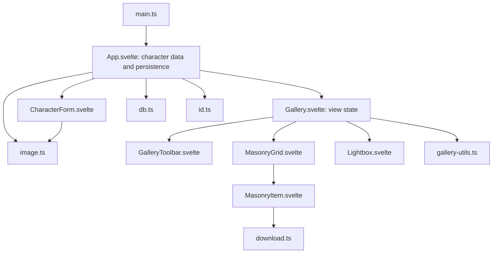

# Character Gallery: Developer Wiki

> This document describes the current codebase. Read it before you change the code.
> It uses short sentences and the active voice, as `docs/ASD-STE100-LLM-Writing-Rules.md` recommends.
> For a machine-readable summary, see `docs/LLM-WIKI.md`. For the layout design, see `docs/designMasonry.md`.

## 1. Overview

The Character Gallery is a browser-only application. It stores character cards in IndexedDB. A card holds a name, a description, and an image. The app shows the cards in a masonry gallery, with search, sort, batch delete, and a detail view. The app can export one image as a PNG file.

The app has no backend. It has no runtime dependencies. All entries in `devDependencies` are build tools or test tools.

## 2. Quick Start

Requirements: Node.js 18 or newer and npm.

| Command | Action |
|---|---|
| `npm install` | Install the dependencies. |
| `npm run dev` | Start the Vite development server on port 5173. |
| `npm run build` | Build the production bundle into `dist/`. This command does not type-check. |
| `npm run preview` | Serve the built bundle. |
| `npm run check` | Run `svelte-check` one time. This command type-checks `src` and `tests`. |
| `npm run check:watch` | Run `svelte-check` in watch mode. |
| `npm test` | Run the Vitest suite one time. |
| `npm run test:watch` | Run the tests in watch mode. |
| `npm run test:ui` | Open the Vitest user interface. |

Run `npm run check` and `npm test` before you commit. The repository has no CI and no linter, so these two commands are the gate.

To reset the local data, open the browser devtools, go to **Application > IndexedDB**, and delete the `character-gallery` database. You can also run `indexedDB.deleteDatabase('character-gallery')` in the console.

## 3. Technology Stack

| Area | Choice | Notes |
|---|---|---|
| UI and state | Svelte 5 | Runes only (`$state`, `$derived`, `$props`, `$effect`). No stores. |
| Build | Vite 6 | `vite.config.ts`. Root is the repository root. |
| Styles | Tailwind CSS 4 | Through the `@tailwindcss/vite` plugin. Theme tokens live in `src/style.css`. |
| Types | TypeScript 5.6 | Strict mode plus `noUnusedLocals`, `noUnusedParameters`, `noFallthroughCasesInSwitch`. |
| Storage | IndexedDB | No library. The wrappers are in `src/db.ts`. |
| Tests | Vitest 5 + jsdom | `environment` is `node` by default. DOM tests opt in per file. |

## 4. Architecture

The app is one page with five layers: the entry point, the page shell, the view components, the pure helpers, and the storage layer.



Rules of the design:

- `App.svelte` owns the database connection and the `characters` array. It is the only component that writes to the database.
- `Gallery.svelte` owns everything about the view: search, sort, paging, selection, and the selected character.
- Child components receive data and callbacks through props. They never import the database.
- The pure helpers (`gallery-utils.ts`, `download.ts`, `id.ts`, `image.ts`) hold no component state.

### Data flow for a save

1. `CharacterForm.svelte` collects the name, the description, and the image data URL. It measures the image.
2. The form calls `onSave`, which is `App.handleSave`.
3. `App.handleSave` builds the `Character` record and calls `dbAdd`.
4. `App` reloads the full list with `dbGetAll` and assigns `characters`.
5. `Gallery.svelte` derives the filtered, sorted, and paged list from the new array.

## 5. Source Layout

| Path | Purpose |
|---|---|
| `index.html` | HTML entry page. It loads `src/main.ts`. |
| `src/main.ts` | Mounts `App` into `#app` and imports `style.css`. |
| `src/App.svelte` | Page shell. Database connection, list state, save and delete actions, dimension backfill. |
| `src/types.ts` | The `Character` interface. |
| `src/db.ts` | IndexedDB schema and the read and write functions. |
| `src/id.ts` | `generateId`. |
| `src/image.ts` | `measureImage`, which reads the intrinsic size of an image. |
| `src/gallery-utils.ts` | Page size, the sort type, and the search and sort rules. |
| `src/download.ts` | Data URL parsing, PNG conversion, file name rules, and the download action. |
| `src/style.css` | The Tailwind import and the color theme. |
| `src/components/Gallery.svelte` | View state, paging, selection, lightbox state. |
| `src/components/GalleryToolbar.svelte` | Search box, sort control, selection controls. |
| `src/components/MasonryGrid.svelte` | Column layout, keyed list, animation, empty state. |
| `src/components/MasonryItem.svelte` | One card: image, hover label, download button, selection box. |
| `src/components/Lightbox.svelte` | Detail dialog with keyboard and button navigation. |
| `src/components/CharacterForm.svelte` | Add and edit form. |
| `tests/` | Vitest files and helpers. See section 11. |
| `docs/` | This wiki, the LLM wiki, the layout design, and the writing rules. |

## 6. Data Model

`src/types.ts` defines one interface:

```ts
export interface Character {
  id: string;          // IndexedDB key path. Opaque. Never shown to the user.
  name: string;        // Required. Shown on the card and in the lightbox.
  description: string; // Optional. Searched and shown in the lightbox.
  image: string;       // Required. Base64 data URL, for example "data:image/png;base64,...".
  width?: number;      // Intrinsic width in pixels. Optional for an old record.
  height?: number;     // Intrinsic height in pixels. Optional for an old record.
  createdAt: number;   // Milliseconds since the epoch. Set once.
}
```

Rules:

- `width` and `height` must describe `image`. A wrong value distorts the card shape, because `MasonryItem` reserves the space from these numbers.
- When the size is unknown, leave both fields empty. The backfill measures them after the next load.
- `createdAt` never changes after the first save. `App.handleSave` copies the stored value during an edit, so the sort order stays stable.

## 7. Storage Layer

The database name is `character-gallery`. The name is a literal in `App.svelte`. The version is `1`. The version constant lives in `src/db.ts`.

The object store is `characters`. The key path is `id`. The store has one index, `name`, which is not unique. No query uses the index today. The list is read with `getAll` and sorted in memory.

### Functions in `src/db.ts`

| Function | Contract |
|---|---|
| `openDB(dbName: string): Promise<IDBDatabase>` | Opens the database at version 1. On the first open, the upgrade handler creates the store and the `name` index. |
| `dbAdd<T>(db, item): Promise<void>` | `put`, so the call inserts or replaces a record. Resolves on commit. |
| `dbDelete(db, id): Promise<void>` | Deletes one record. Deletes of a missing id succeed. |
| `dbDeleteMany(db, ids): Promise<void>` | Deletes many records in one transaction. An empty array is allowed. |
| `dbGetAll<T>(db): Promise<T[]>` | Reads every record in key order. |

The private helper `awaitTransaction` attaches `oncomplete`, `onerror`, and `onabort`. A transaction that aborts fires only `abort`, so a handler for `abort` is necessary. Without it, a caller can wait forever.

### How to change the schema

1. Increase `DB_VERSION` in `src/db.ts`.
2. Add the change in the `onupgradeneeded` handler. Guard a new store or index with a `contains` test, as the current code does.
3. Give old records a default value in `App.backfillDimensions` or in a new backfill function. Keep the guard that re-reads the record before the write.
4. Update `tests/db.test.ts`. Add a test that opens an old version and then runs the upgrade.

## 8. Module Reference

### `src/id.ts`

```ts
export function generateId(): string;
```

Uses `crypto.randomUUID()` when the browser supplies it. Otherwise the function returns the current time in base 36 plus a random value. The fallback covers plain HTTP origins, where `crypto.randomUUID` is absent.

### `src/image.ts`

```ts
export function measureImage(src: string): Promise<{ width: number; height: number }>;
```

Loads the source in an `Image` element and resolves with `naturalWidth` and `naturalHeight`. The promise rejects when the image does not load. The function reads the image again from the data URL, so the browser does not need a network request.

### `src/gallery-utils.ts`

```ts
export const PAGE_SIZE = 24;
export type SortMode = 'newest' | 'oldest' | 'name';

export function filterCharacters(characters: Character[], searchTerm: string): Character[];
export function sortCharacters(characters: Character[], sortMode: SortMode): Character[];
export function filterAndSortCharacters(
  characters: Character[],
  searchTerm: string,
  sortMode: SortMode
): Character[];
```

Rules:

- `filterCharacters` matches the name or the description, without regard to case. An empty or blank term returns the input array itself. Callers must not mutate the result.
- The filter tolerates a record with a missing name or description.
- `sortCharacters` copies the array first. It never mutates the input.
- The `name` order uses `localeCompare` with `sensitivity: 'base'` and `numeric: true`. `apple` therefore sorts with `Apple`, and `Character 2` sorts before `Character 10`.

### `src/download.ts`

```ts
export function parseDataUrl(dataUrl: string): { mime: string; base64: string; ext: string };
export function base64ToBlob(base64: string, mime: string): Blob;
export function sanitizeFilename(name: string): string;
export async function downloadCharacterImage(character: Character): Promise<void>;
```

`parseDataUrl` accepts `data:<mime>[;param...],<payload>`. The MIME type must start with `image/`. The parameters must include `base64`. The parser lowercases the MIME type, so `data:IMAGE/PNG;BASE64,` works. The parser also accepts a `+` in the subtype, such as `image/svg+xml`. It throws on a non-image type, on a non-base64 payload, and on text that is not a data URL.

`sanitizeFilename` removes the characters `\ / : * ? " < > |`, the control characters, the leading and trailing space, and the trailing dots. It returns `character` for an empty result and for the reserved Windows device names (`con`, `prn`, `aux`, `nul`, `com1` to `com9`, `lpt1` to `lpt9`), with or without an extension.

`downloadCharacterImage` writes a PNG file:

1. Parse the data URL.
2. PNG source: decode the base64 text straight to a blob.
3. Other image types: draw the image on a canvas and export `image/png`.
4. Create an object URL, click a temporary link, and release the URL after 60 seconds.

Do not release the object URL immediately. The browser reads the blob after the click returns. A release at once can cancel the download.

## 9. Components

### `App.svelte`

Owns `db`, `characters`, `editingCharacter`, `showForm`, and `loading`. Starts the app in `init()`.

| Callback | Behavior |
|---|---|
| `handleSave(data)` | Builds the record. Reuses the id and the `createdAt` value for an edit. Writes the record, closes the form, and reloads the list. |
| `handleDelete(id)` | Asks for a confirmation, deletes the record, and removes it from the array. |
| `handleDeleteMany(ids)` | Asks for a confirmation, deletes the records, and returns a boolean. |
| `backfillDimensions()` | Measures every record without a size and writes the result. Re-reads each record first, and skips a record that changed or disappeared. |

The markup shows one of three states: the form, the loading text, or the gallery. The form is inside `{#key editingCharacter?.id ?? 'new'}`. The key makes a new form instance for each target, so the form state can never belong to another character.

### `Gallery.svelte`

Props: `characters`, `onEdit`, `onDelete`, `onDeleteMany`.

State: `searchTerm`, `sortMode`, `selectedCharacter`, `selectMode`, `selectedIds`, `visibleCount`, `sentinelEl`.

Derived: `filteredCharacters`, `visibleCharacters`, `hasMore`.

Behavior:

- A search or a sort change resets `visibleCount` to `PAGE_SIZE`.
- A card opens the lightbox only when `selectMode` is false.
- The sentinel `div` renders while `hasMore` is true.
- The effect that creates the `IntersectionObserver` reads `sentinelEl` from state. The effect therefore runs again when the element appears, is replaced, or is removed, and it disconnects the old observer.

Keep `sentinelEl` as `$state`. A plain variable breaks the paging after the first list change. `tests/gallery-scroll.test.ts` covers this case.

### `GalleryToolbar.svelte`

Props: `searchTerm`, `sortMode`, `onSearchChange`, `onSortChange`, `selectMode`, `selectedCount`, `onToggleSelectMode`, `onDeleteSelected`, `onCancelSelect`.

Two modes. The normal mode shows the search field, the sort select, and the **Select** button. The selection mode shows the count, the **Delete Selected** button (disabled at zero), and the **Cancel** button.

### `MasonryGrid.svelte`

Props: `characters`, `animate`, `onOpen`, `selectMode`, `selectedIds`, `onToggleSelect`, `onDownload`.

The container uses the CSS multi-column layout: `columns-[14rem] gap-4 sm:columns-[16rem] lg:columns-[18rem]`. The browser picks the number of columns. The app never calculates positions in JavaScript.

The list is keyed by `character.id` and animated with `animate:flip` plus `in:fade` and `out:fade`. The durations are 260 ms, 160 ms, and 140 ms. They become 0 when the `animate` prop is false or when the user asked for reduced motion.

The reduced-motion preference is read one time at component creation. A change of the system setting during the session does not restart the animations.

### `MasonryItem.svelte`

Props: `character`, `onOpen`, `selectMode`, `selected`, `onToggleSelect`, `onDownload`.

The card is a `figure` with `break-inside-avoid`, so a column break never splits it. The inner `button` has the character name as its label. The image sits in a `div` with `aspect-ratio: width / height`. The fallback ratio is 4 / 3 when a record has no size yet.

The image uses `loading="lazy"` and `decoding="async"`. `width` and `height` are set from the record, so the browser reserves the space before the image decodes.

The hover label and the download button fade in on hover and on focus. Only the transitions are disabled under reduced motion. The states themselves always apply.

### `Lightbox.svelte`

Props: `character`, `characters`, `onEdit`, `onDelete`, `onClose`, `onSelect`.

The component renders a `<dialog>` with `aria-labelledby`. `showModal` traps the focus and blocks the background. The dialog closes on Escape through the browser, on the close button, and on the Edit and Delete actions. The previous and next buttons change the record and keep the dialog open.

The `close` event is the only teardown path. `teardown` restores the focus to the element that opened the dialog and calls `onClose`, which clears `selectedCharacter` in `Gallery`. Do not add a second teardown path. A second path makes the state and the focus depend on which path ran first.

Keys: `ArrowLeft` and `ArrowRight` move through the filtered list. The buttons do the same for touch users. Both are disabled at the ends of the list.

### `CharacterForm.svelte`

Props: `editingCharacter`, `onSave` (async), `onCancel`.

State: `name`, `description`, `imagePreview`, `saving`, `measured`.

Behavior:

- The file input reads the file one time. The same data URL serves the preview, the measurement, and the saved record.
- `measured` holds the size together with the data URL it belongs to. The form never stores the size of a different image.
- Submit awaits `onSave`, disables the button, and shows an alert when the write fails, for example when the storage quota is full.
- The initial values come from `editingCharacter` inside `untrack`. The call is intentional, because `App` mounts a new form for each target.

## 10. Core Flows

**Startup.** `main.ts` mounts `App`. `init` opens the database and loads the list. `loading` becomes false. The backfill starts in the background and does not block the first paint.

**Add.** The user clicks **+ Add Character**. The form mounts with the key `new`. A save writes a record with a new id and the current time.

**Edit.** The lightbox calls `onEdit`. `App.startEdit` sets `editingCharacter` and shows the form. The key is the character id, so the form mounts with the stored values. A save keeps the id and the `createdAt` value.

**Delete.** One delete comes from the lightbox, a batch delete from the toolbar. Both ask for a confirmation first. The lightbox closes before the confirmation appears.

**Search and sort.** `Gallery` computes `filteredCharacters` from the full list on every change. The page count returns to the first page.

**Paging.** The observer adds 24 records when the sentinel becomes visible. The count stops at the length of the filtered list, so the app never asks for a page that does not exist.

**Lightbox navigation.** The arrows change `selectedCharacter` through `onSelect`. The dialog stays open and shows the new record.

**Download.** The card button and the lightbox button call `downloadCharacterImage`. A failure goes to the console.

## 11. Styling and Layout

`src/style.css` holds the whole custom style surface. It imports Tailwind and declares the theme tokens:

| Token | Value | Use |
|---|---|---|
| `--color-bg-primary` | `#1a1a2e` | Page background. |
| `--color-bg-secondary` | `#16213e` | Header, form, and dialog background. |
| `--color-bg-card` | `#0f3460` | Declared but not used today. |
| `--color-accent` | `#e94560` | Primary actions and headings. |
| `--color-accent-hover` | `#d63a54` | Hover state of a primary action. |
| `--color-border` | `#533483` | Borders and secondary buttons. |

Use the token names (`bg-accent`, `text-accent`, `border-border`) rather than raw colors.

Layout rules:

- The gallery uses CSS columns. Do not add a JavaScript masonry engine. See `docs/designMasonry.md` for the reasons.
- A card reserves its space with `aspect-ratio`. Keep the reserved space when you change the card.
- Animate only `transform` and `opacity`.
- Gate a movement or a transition with `motion-safe:` or `motion-reduce:`. Never gate the visibility of a control. A reduced-motion user must still see the hover label and the download button.
- Use `focus-visible` rings on every control.

## 12. Accessibility

- Every card is a real `button`. Enter and Space open it.
- The download button has an `aria-label` with the character name.
- The dialog has an accessible name through `aria-labelledby`.
- The dialog traps the focus and restores it on close.
- Every image has an `alt` text or an empty `alt`.
- The reduced-motion preference stops the animation, not the function.
- The focus ring is always visible. Do not remove it without a replacement.

## 13. Testing

The suite runs in the `node` environment. A test file that needs the DOM starts with `// @vitest-environment jsdom`.

| File | Coverage |
|---|---|
| `tests/db.test.ts` | Open, add, replace, delete, delete many, read, and the failure path. |
| `tests/id.test.ts` | Uniqueness and the two id paths. |
| `tests/download.test.ts` | The data URL parser, the blob conversion, and the file name rules. |
| `tests/gallery-utils.test.ts` | Search and sort, including the edge cases. |
| `tests/gallery-scroll.test.ts` | Paging with a fake `IntersectionObserver`, mounted on the real components. |
| `tests/app.test.ts` | The full workflow on the real `App`: load, add with a file, edit, delete. |

Helpers:

- `tests/fixtures.ts` holds `PNG_1X1` and `makeCharacter` / `makeCharacters`.
- `tests/GalleryHarness.svelte` mounts `Gallery` and exposes `setCharacters`, so a test can change the list the way `App` does.
- `tests/setup.ts` adds `fake-indexeddb` and stand-ins for the browser interfaces that jsdom does not supply: `matchMedia`, the Web Animations API, and the `<dialog>` methods.

### Recipe: a component test

```ts
// @vitest-environment jsdom
import { flushSync, mount, tick, unmount } from 'svelte';
import { expect, it } from 'vitest';
import MyComponent from '../src/components/MyComponent.svelte';

async function settle() {
  for (let i = 0; i < 5; i += 1) {
    flushSync();
    await tick();
  }
  flushSync();
}

it('does the thing', async () => {
  const target = document.createElement('div');
  document.body.appendChild(target);
  const app = mount(MyComponent, { target, props: { /* ... */ } });

  await settle();
  expect(target.textContent).toContain('expected text');

  unmount(app);
  target.remove();
});
```

Notes:

- Call `settle()` after a change that starts a transition. The animation stand-in in `tests/setup.ts` completes on a microtask, so a flush plus a tick is enough.
- Use `vi.waitFor` for a value that arrives through a promise, such as a database read. `tests/app.test.ts` shows the pattern.
- Stub `Image` when a test reaches `measureImage`. jsdom does not decode images.
- Stub `confirm` and `alert` before a test touches a delete or a validation path.

### What the tests do not cover

- A real browser. The jsdom stand-ins approximate the dialog, the animations, and `matchMedia`.
- The focus trap of the dialog and the Escape key, because the jsdom dialog is a stand-in.
- The canvas path of `downloadCharacterImage`, because jsdom has no canvas.
- The performance of the gallery with a large library.

## 14. Verification and Build

`npm run check` uses `tsconfig.json`, which includes `src` and `tests`. The check covers the components, the modules, and the test files. Keep the result at zero errors and zero warnings.

`npm run build` writes `dist/index.html`, `dist/assets/*.css`, and `dist/assets/*.js`. The build does not run the type check. Run `npm run check` first, or add the check to your own workflow.

## 15. Extension Recipes

### Add a field to `Character`

1. Add the field to `src/types.ts`.
2. Give it a default in `App.handleSave`.
3. Change the form in `src/components/CharacterForm.svelte`.
4. Add the field to the search in `src/gallery-utils.ts` when it must be searchable.
5. Add a backfill for old records, and keep the re-read guard.
6. Change `DB_VERSION` and the upgrade handler only when the change touches a store or an index.
7. Extend `tests/db.test.ts`, `tests/gallery-utils.test.ts`, and `tests/app.test.ts`.

### Add a sort mode

1. Add the value to `SortMode` in `src/gallery-utils.ts`.
2. Add the case to `sortCharacters`, and keep the copy of the input array.
3. Add the option to the select in `src/components/GalleryToolbar.svelte`.
4. Add a test in `tests/gallery-utils.test.ts`.

### Change the page size

Change `PAGE_SIZE` in `src/gallery-utils.ts`. `Gallery` and the tests use the constant. Do not hard-code the number again.

### Change a theme color

Change the token in `src/style.css`. The components use the token names, so no component change is necessary.

### Add a component test

Follow the recipe in section 13. Add the file to `tests/`. No configuration change is necessary, because the include pattern is `tests/**/*.test.ts`.

## 16. Design Decisions and History

| Decision | Reason |
|---|---|
| CSS multi-column layout | The browser does the layout work. The app needs no measurement loop. See `docs/designMasonry.md`. |
| `aspect-ratio` from stored dimensions | A card reserves its space before the image decodes, so the columns do not jump. |
| `sentinelEl` is `$state` | The sentinel appears only after the first page is full. An effect with no reactive dependency runs once and never attaches an observer. `tests/gallery-scroll.test.ts` guards this behavior. |
| `createdAt` copied on edit | A save used to set the current time, so an edit moved the card to the top of the `newest` order. |
| Re-read guard in the backfill | The backfill decodes an image while the user can edit the same record. The old code wrote the stale copy back and lost the edit. |
| `untrack` in the form | The form snapshots the prop on purpose. `App` keys the form by target, so the snapshot is always correct. |
| 60-second object URL lifetime | The browser reads the blob after the click returns. An immediate release can cancel a download. |
| Rejection on `abort` in `db.ts` | An aborted transaction fires only `abort`. Without a handler, the promise never settles. |
| Empty state inside the column container | The message sits in the same box as the cards, so the layout code stays in one place. The `col-span-full` class on it has no effect there and can be removed. |

## 17. Known Limits

- The app reads every record into memory at start. It renders 24 cards at a time, but the browser holds the whole library.
- The image is a base64 string. This form is about one third larger than the binary data, and the string stays in memory. A blob store plus a thumbnail would scale better.
- A card shows no error state when an image fails to decode. The card keeps its shape, but the user sees an empty frame.
- The lightbox does not close on a click on the backdrop. Escape and the close button work.
- `Gallery` passes `animate={true}` to `MasonryGrid` as a literal, so the `animate` prop of that component is not reachable from the app today.
- The list animation cost grows with the number of rendered cards. The default page size limits the effect.
- The app has no import or export for character cards. A library cannot move between browser profiles.
- The database connection stays open for the lifetime of the page. This behavior is correct for a single-page app. A future schema change in another tab waits for the reload.
- The repository has no CI, no linter, and no formatter. Run `npm run check` and `npm test` by hand.
- `--color-bg-card` is declared but unused.

## 18. Documentation Map

| Document | Audience | Update when |
|---|---|---|
| `docs/WIKI.md` | Developers | A module, a flow, or a convention changes. |
| `docs/LLM-WIKI.md` | Coding agents | The file map, the invariants, or the commands change. |
| `docs/designMasonry.md` | Developers | The layout strategy or the animation model changes. |
| `docs/ASD-STE100-LLM-Writing-Rules.md` | Writers | Rarely. It is the style reference for the other documents. |

When you change the code, change the matching document in the same commit. The wiki described an old implementation for a long time, because nothing tied the two together.
